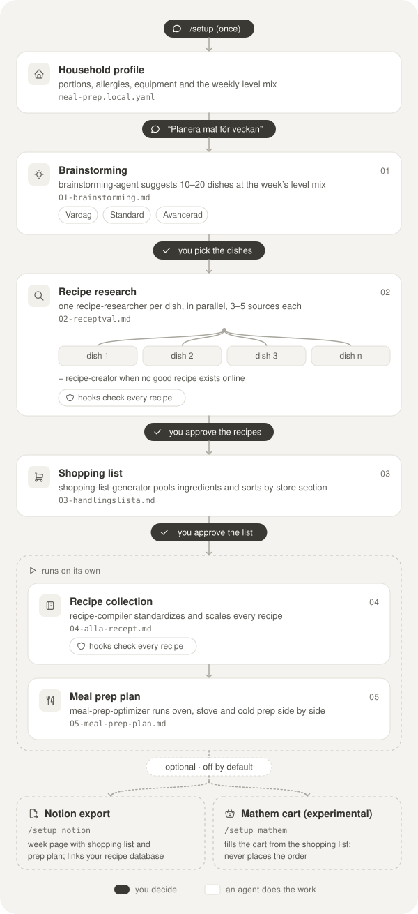

# Meal Prep Agents

HelloFresh-style weekly meal planning for Swedish households, run by a team of
[Claude Code](https://claude.com/claude-code) agents. Tell it what your household likes;
it suggests dishes, finds the best recipe for each one, writes a pooled shopping list, compiles the
recipes into one consistent format scaled to your portions, and plans a cooking session
that gets everything done as quickly as possible.

> **All output is in Swedish**, with metric units and Swedish grocery-store names. That
> is a deliberate product choice: the recipe standard, the validators and the source
> list are built for Swedish kitchens. This README is in English so more people can
> read about it.

## Quickstart

You need [Claude Code](https://claude.com/claude-code), `git` and `python3` (3.9+).

```bash
git clone https://github.com/andreroxhage/meal-prep-agents.git
cd meal-prep-agents
claude
```

Then, inside Claude Code:

```
/setup
```

`/setup` asks a few questions (portions, meals, allergies, equipment, how many
everyday vs. weekend dishes) and saves your answers to `meal-prep.local.yaml`. That file
is gitignored, so your household stays on your machine. Then:

```
Planera mat för veckan
```

That's it. Claude creates a folder for the week (`YYYY-MM-DD/`, also gitignored) and
walks you through the phases below, stopping for your approval between them.

## How it works

<p align="center">
  
</p>

The same flow in plain text:

```
Phase 1  Brainstorming       brainstorming-agent suggests 10–20 dishes        ── you pick
Phase 2  Recipe research     one recipe-researcher per dish, in parallel,     ── you approve
                             each comparing 3–5 sources (+ recipe-creator
                             for dishes with no good recipe online)
Phase 3  Shopping list       shopping-list-generator pools and normalizes     ── you approve
Phase 4  Recipe collection   recipe-compiler scales and standardizes every recipe
Phase 5  Meal prep plan      meal-prep-optimizer runs oven, stove and cold prep in parallel
         Optional extras     Notion export, Mathem cart — only if you turned them on
```

What you get in the week folder:

| File | Contents |
|---|---|
| `01-brainstorming.md` | Candidate dishes, each tagged Vardag / Standard / Avancerad |
| `02-receptval.md` | The chosen recipe per dish, with links and scaling factors |
| `03-handlingslista.md` | One pooled shopping list, grouped by store section |
| `04-alla-recept.md` | Every recipe in one format, scaled to your portions |
| `05-meal-prep-plan.md` | A timed plan for cooking everything in one session |

### Dish levels

Each week mixes three levels (the default is 3 + 1 + 1, asked every week):

- **Vardag** — 30–45 min, cheap proteins, but always with one *lyft* (a homemade sauce,
  quick pickle, hard sear) so cheap never means boring.
- **Standard** — 45–60 min.
- **Avancerad** — technique-heavy weekend projects.

### A recipe standard enforced by code

Recipes are written for someone standing at the stove: every step repeats the amount
inline (`Häll **1,5 dl** mjölk över **1 dl** ströbröd`). This is not left to the model's
goodwill. Hooks in `.claude/hooks/` normalize and validate every recipe file as it is
written, block the recipe agents from finishing while errors remain, and cross-check
the shopping list against the recipes. The standard lives in
[`.claude/rules/recipe-style.md`](.claude/rules/recipe-style.md).

## Commands

| Command | What it does |
|---|---|
| `/setup` | Create or change your household profile; turn optional extras on or off |
| `/setup visa` | Show your current profile |
| `/meal-planning-hello-fresh` | Start the weekly workflow (or just say "Planera mat för veckan") |
| `/create-recipe [dish] [portions]` | Write a recipe from scratch |
| `/verify-recipes [YYYY-MM-DD]` | Check a week's recipes and shopping list against the standard |
| `/export-to-notion [YYYY-MM-DD]` | *Optional:* publish a week to Notion |
| `/mathem-cart [YYYY-MM-DD]` | *Optional, experimental:* fill a Mathem cart from the shopping list |

To run the whole workflow as a single agent instead: `claude --agent meal-planning-orchestrator`.

## Your household profile

`/setup` writes `meal-prep.local.yaml`. Anything not in it falls back to
[`meal-prep.example.yaml`](meal-prep.example.yaml), which documents every key:

| Key | Default |
|---|---|
| `household.portions_per_recipe` | 4 |
| `household.meals` | middag (dinner) |
| `cook.experience` | van (confident home cook) |
| `diet.protein_focus` / `allergies` / `avoid` | varierat / none / none |
| `kitchen.equipment` | oven + 4-ring stove |
| `level_mix` | 3 Vardag + 1 Standard + 1 Avancerad |
| `integrations.notion.enabled` / `mathem.enabled` | `false` / `false` |

Allergies are hard constraints: every agent receives them, and no suggestion, recipe or shopping
list may include them. Anything you say in the conversation ("bara 2 portioner den här
veckan") overrides the profile for that week.

## Optional extras (off by default)

### Notion export

Publishes a finished week to your own Notion workspace: an overview page with the
shopping list and meal-prep plan as subpages, linking to recipes in a recipe database
(recipes are never duplicated). Requires the Notion connector in Claude Code. Turn it on
with `/setup notion`; it finds your databases or creates them.

### Mathem cart (experimental)

Turns the shopping list into a filled cart at [Mathem](https://www.mathem.se) using a
small Python CLI in [`tools/mathem_cart/`](tools/mathem_cart/) plus Claude agents that
pick the right products. It **never places an order**: you review the cart and check out
in the Mathem app yourself. Requires [`uv`](https://docs.astral.sh/uv/), Python 3.11+
and your own Mathem account in `.env` (copy from `.env.example`). Turn it on with
`/setup mathem`.

> This integration is unofficial and not affiliated with or endorsed by Mathem. It uses
> your own account, talks to Mathem's web API like a browser would, and may stop working
> whenever Mathem changes their site. Use it at your own risk.

## Troubleshooting

- **Recipes aren't being checked.** The hooks need `python3`. Claude warns you at session start if it's missing.
- **Clone, don't download a zip.** The recipe gate uses `git status` to find recipe
  files an agent changed. Without git it falls back to recently modified files, which is less precise.
- **Windows.** Use WSL. The hooks are bash scripts, and `AGENTS.md` / `.agents/skills`
  are symlinks (enable `core.symlinks` if you clone natively).
- **Many permission prompts in Phase 2.** Recipe research uses web search and fetch;
  `/setup` can allow them for you in `.claude/settings.local.json`.

## Repository layout

```
.claude/
  agents/        the phase agents, the orchestrator and the Mathem matchers
  skills/        setup, the main workflow, create/verify recipes, Notion, Mathem, no-ai-slop
  rules/         the recipe standard and few-shot examples
  hooks/         recipe validation, the subagent gate, the first-run nudge
  settings.json  hook registration and permissions (asks before Mathem apply, denies .env)
recipe/          a small library of house recipes
tools/mathem_cart/  the optional Mathem CLI (Python, tested offline)
docs/design/     design notes for the Mathem integration
meal-prep.example.yaml   profile template and defaults
CLAUDE.md        instructions every agent reads (AGENTS.md is a symlink to it)
```

## Contributing

Issues and pull requests are welcome. Before opening a PR:

```bash
python3 .claude/hooks/test_validate.py                  # recipe validator
python3 .claude/hooks/test_validate_week.py             # shopping list ↔ recipes check
uv run --project tools/mathem_cart pytest -q            # Mathem CLI (offline)
```

Recipes added to `recipe/` must pass `/verify-recipes` and be written in your own words,
with sources listed under `## Källor`.

Optional: `git config core.hooksPath .githooks` runs the CI leak check (personal IDs,
paths, emails) before each commit. `git commit --no-verify` skips it.

## License

[MIT](LICENSE). Third-party code:

- `tools/mathem_cart/mathem_cart/mathem/` is adapted from
  [ha-mathem](tools/mathem_cart/mathem_cart/mathem/LICENSE-ha-mathem) (MIT).
- `.claude/skills/no-ai-slop/` is vendored from the author's own skills collection.
